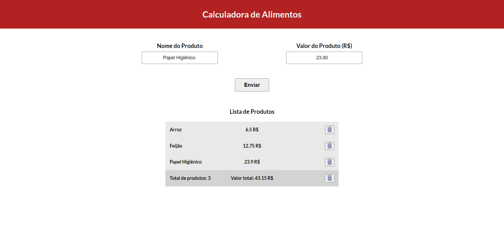

### Sobre

- Projeto simples feito com angular para aplicar os conhecimentos que venho adquirindo

### Como funciona

- Na aplicação o usuário entra com o nome do produto e seu respectivo valor
- Então é criada uma lista mostrando o que inputado
- Mostra também o número total de produtos e o valor total dos produtos

### Como rodar

- Basta fazer um git clone na sua máquina e rodar o comando: `` ng s --o ``

### Aplicação em funcionamento

  
